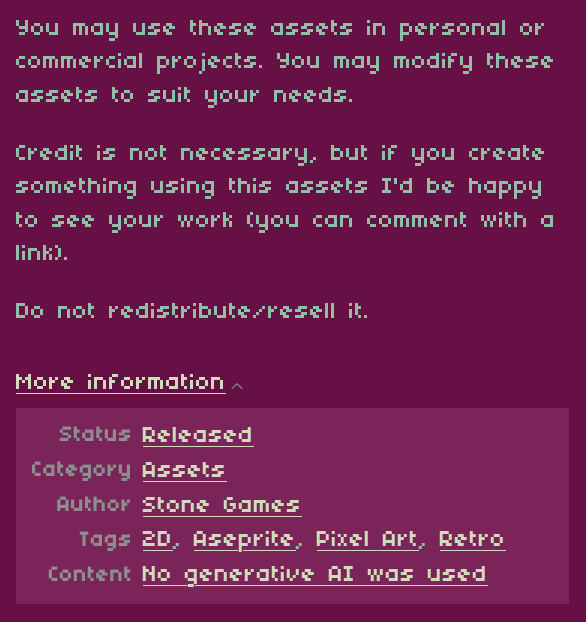

# The Keeper

**PyWeek 41 -- Theme: Nightfall**

---

## Story

This lighthouse was built by your grandfather. Your father maintained it. Now it is your turn.

You are the newest generation of a family bound to an isolated island and the aging lighthouse that stands on it. The beacon keeps the ships safe. You keep the beacon running. That is enough.

For the first few days, the work is routine. You fix frayed wires, clean salt off the lens, log pressure readings, and keep the generator fed. A fisherman drops off supplies and remarks that the sky looks strange. You agree and get back to work.

Then the Nightfall begins.

Day by day, the sky bleeds redder. The ocean takes on the color of rust. The daylight hours shrink. The lighthouse systems start failing without warning -- breakers trip, the engine overheats, the lens fouls itself in the span of an hour. On Day 5 a scientist arrives and sets up sensors on the beach. He tells you the sun is being eclipsed by something no instrument can identify, that the red refraction index is unprecedented, that night is coming for good. On Day 7 the fisherman makes his last supply run. The water looks like blood and his engine is choking on red grit. He will not be coming back.

By Day 9 the sun does not rise at all. The scientist is begging you to leave. There are no boats left. On Day 10 the world is entirely blood-red. A massive earthquake strikes, the ground tears open, and the screen fades to black.

The light was all you had. You kept it spinning.

---

## Dependencies

- **Python 3.10 – 3.13** (Python 3.14+ is not supported — `pygame` does not install on it yet)
- **pygame 2.1.0 or later**
- **pytmx**

Install all dependencies with:

```bash
pip install pygame pytmx
```

> **Note:** Use Python 3.10, 3.11, 3.12, or 3.13. `pygame` currently cannot be built on Python 3.14.
> `run_game.py` will exit with a clear error message if your Python or pygame version is incompatible.

---

## How to Run

```bash
pip install -r requirements.txt
```

`run_game.py` is the standard entry point. It checks your Python version and exits with a clear message if it is too old, then launches the game. You can also run `main.py` directly, but `run_game.py` is recommended.

---

## Controls

| Input | Action |
|---|---|
| A / D or Left / Right Arrow | Move |
| Click | Move to position |
| Space / Enter | Advance dialogue |
| F11 | Cycle display mode (Windowed / Borderless / Fullscreen) |

---

## Gameplay

The Keeper is a 10-day survival management game. Each day has two phases: day and night.

**During the day**, a taskboard shows the jobs that need doing before nightfall. You walk through the lighthouse interior, interact with equipment, and complete a short minigame for each task. The tasks are mundane at first -- replace frayed cables, clean the lens, vent engine pressure -- but grow heavier as the days pass. On Day 5 you assist the scientist on the beach. On Day 7 you board up the lower doors. On Day 9 you crank the light by hand because the motor is failing.

**During the night**, emergencies begin firing at random. A generator failure, a tripped breaker, a fouled lens, an overheating engine -- each emergency interrupts your routine and demands you drop everything and resolve it before the beacon goes dark. The number of emergencies per night and the speed at which they arrive both increase as the days progress. On Day 10 every emergency fires at once.

From Day 6 onward, the day and night phases collapse into a single continuous scene. Emergencies can trigger at any point and there is no clean boundary between routine maintenance and crisis response.

The sky color shifts with each passing day, transitioning from a cool blue-grey on Day 1 to a blood-red color by Day 10. A translucent red overlay grows progressively stronger over the world, tinting every surface. The lighthouse beam dims and cuts out when an emergency is active and the interactable responsible for it has not yet been reached.

---

## Minigames

Each task and emergency is resolved through one of eight hands-on minigames:

- **Reconnect the Wires** -- Drag three frayed wire ends to their matching colored slots to complete the circuit.
- **Clean the Lens** -- Pick up the rag and drag it across a grid of dust cells until the lens is clear.
- **Fix the Breaker** -- A panel of eight switches, five of them tripped red. Click each tripped switch to reset it.
- **Log Barometric Pressure** -- Read a barometer dial and type the correct pressure value into the logbook.
- **Lubricate the Engine** -- Drag an oil can nozzle over four engine ports to lubricate each one.
- **Release Pressure Valves** -- Five valves, each showing a pressure reading. Click them in ascending order, lowest to highest. Clicking out of order resets progress.
- **Refuel the Generator** -- Hold the pump button to fill the tank. Release and it stops.
- **Manual Crank** -- The motor is failing. Click the crank handle rapidly to keep the beam spinning. Power drains continuously and refills with each click. Sustain it above zero for the full duration.

---

## NPC Schedule

Two characters visit the island across the 10 days. Their dialogue reflects how their understanding of the Nightfall evolves.

**The Fisherman** brings supply drops on Days 1, 3, and 7. He goes from remarking that the sky looks like spilled copper to refusing to ever sail out again. Day 7 is his last run.

**The Scientist** arrives on Day 5 to deploy sensors on the beach. He returns on Days 8, 9, and 10. His tone escalates from scientific alarm to desperation. By Day 9 he is demanding you leave. By Day 10 neither of you has anything left to say.

---

## Project Structure

```
The-Keeper/
├── run_game.py              Entry point (start here)
├── main.py                  Core display and event loop
├── requirements.txt         Python dependencies
├── constants/
│   ├── dialogue.py          All in-game text: opening, daily scripts, NPC lines
│   ├── gameplay.py          Day tasks, night tasks, sky colors, interactable flavour text
│   ├── world.py             Interactable positions, lighthouse door, world constants
│   ├── ui.py                Visual constants for dialogue boxes and red overlay alpha per day
│   ├── sounds.py            Sound asset paths
│   └── assets.py            Asset paths
├── core/
│   ├── game.py              Top-level game state machine
│   ├── day_cycle.py         Day counter, elapsed time, sky color blending
│   ├── view.py              Resolution scaling and virtual coordinate system
│   └── sound.py             Music and sound effect management
├── scenes/
│   ├── opening.py           Cinematic intro
│   ├── start_screen.py      Title screen
│   ├── beach_intro.py       Day 5 beach arrival sequence
│   ├── beach.py             Beach scene for scientist encounter
│   ├── day.py               Daytime lighthouse scene with taskboard
│   ├── day_night.py         Combined day/night scene used from Day 6 onward
│   ├── lighthouse.py        Lighthouse rendering, beacon, clouds
│   └── nightfall.py         Nighttime scene with emergency system
├── systems/
│   ├── emergency.py         Emergency pool, timing schedules, escalation by day
│   ├── tasks.py             Day and night task tracking
│   ├── minigame.py          Base minigame class
│   └── minigame_overlay.py  Renders the active minigame on top of the scene
├── entities/
│   ├── player.py            Player movement and rendering
│   ├── interactables.py     Clickable world objects
│   ├── visitors.py          NPC entities and dialogue hooks
│   └── animations.py        Sprite animation loader
├── minigames/
│   ├── fix_wires.py
│   ├── clean_lens.py
│   ├── flip_breakers.py
│   ├── log_pressure.py
│   ├── lubricate_engine.py
│   ├── pressure_valves.py
│   ├── refuel_generator.py
│   └── manual_crank.py
└── ui/
    ├── dialogue.py          Typewriter-effect dialogue box (log style and thought bubble style)
    └── hud.py               Day progress bar, night timer, emergency indicators
```

---

## Contributors

- **ved-in** -- developer / team-leader
- **X3r0Day** -- developer
- **RudyDaBot** -- sound design and assets
- **xodo2fast4u** -- original concept and storyline contributions
- **omnimistic** -- assets

---

## Credits

Dialogue Typing sound -- SD text 9.wav by jobro -- [available here](https://freesound.org/s/33560/) -- License: Attribution 3.0

Background -- [available here](https://ansimuz.itch.io/magic-cliffs-environment) (ansimuz - itch.io) -- License: Creative Commons Zero (CC0)

MC -- [available here](https://ulerinn.itch.io/free-old-man) -- License: MIT License
Scientist -- [available here](https://smithygames.itch.io/bouncy-scientist) -- License: Creative Commons Four (CC4)
Fisherman, Beach Map -- [available here](https://craftpix.net/freebies/free-fishing-game-assets-pixel-art-pack) -- License: [freebies license](https://craftpix.net/file-licenses) (section 2)

Ship -- [available here](https://stonegamesnh.itch.io/ship) -- License: None Provided


Generator, Breaker, Book, Rug, sounds (except Dialogue Typing sound) -- [RudyDaBot](https://github.com/RudyDaBot)

Lighthouse, pointer -- [Omnimistic](https://github.com/omnimistic)
